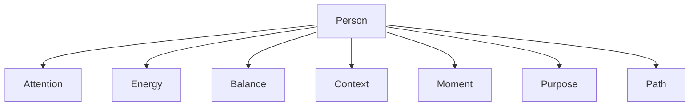
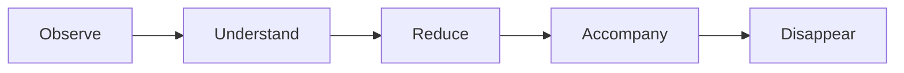

# PERSONALOS_001 — Human-Centered Architecture

## Principle

PersonalOS is designed around a person, not around a computer.

The interface, storage, automation, and future applications are implementation details.
The person is the center.

## Human model

PersonalOS observes seven human dimensions:



## Attention

Attention is the scarcest resource.
Every screen must protect it.

## Energy

Energy changes every day.
The system must adapt the path instead of forcing a fixed path.

## Balance

Balance has priority over productivity.
A useful system that creates anxiety is not aligned with PersonalOS.

## Context

A step never exists alone.
It has material, place, time, emotional state, resources, and purpose.

The system should reduce the need to reconstruct context mentally.

## Moment

PersonalOS thinks in moments, not only in clock time:

- Dawn
- Morning
- Midday
- Afternoon
- Night

## Purpose

Tasks are not the goal.
They are expressions of purpose.

## Path

PersonalOS does not present infinite lists.
It presents paths with a next step.

## Interaction model



The final stage is essential: technology must disappear.

## Core engines

- Balance Engine
- Flow Engine
- Decision Engine
- Journey Engine
- Ritual Engine
- Theme Engine
- Reflection Engine
- Wisdom Engine
- Legacy Engine

## Global state

```text
PersonState
├── attention
├── energy
├── balance
├── moment
├── context
├── next_step
├── journey
├── theme
└── season
```

## Fundamental principle

The computer observes.
The person lives.
