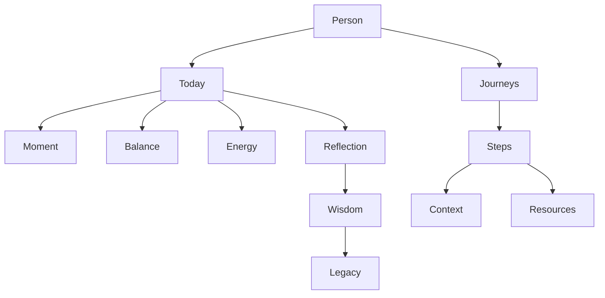
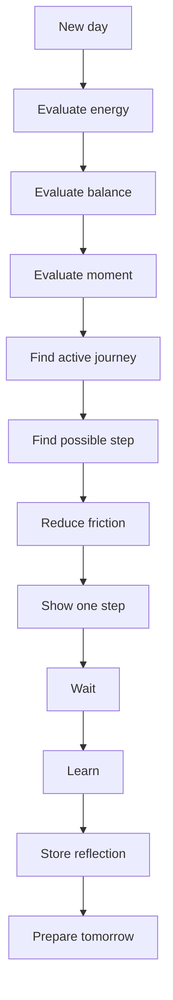

# PERSONALOS_002 — Cognitive Domain Model

## Principle

PersonalOS does not model tasks first.
It models human movement through intention, context, clarity, steps, reflection, wisdom, and legacy.

## Domain overview

## Person

A person is not a user record.
A person is a living center of intention, energy, memory, values, and growth.

## Today

The day is the base unit of the experience.
PersonalOS does not ask the person to live inside weeks or project plans.
It starts with today.

## Moment

The day is divided into human moments, such as dawn, focus, pause, afternoon, and closing.

## Journey

A journey is a meaningful path.
It replaces the traditional idea of a project.

## Step

A step is the smallest meaningful unit of movement.

A step must be small enough to start without planning.
If a step creates anxiety, it is still too large.

## Context

Context is everything needed to start:

- domain
- material
- resource
- due date
- place
- time
- emotional state
- next action

## Resources

Resources should wait for the person.
The person should not have to search for them every time.

## Reflection

Reflection is intentionally small.
One question per day is enough.

## Wisdom

Wisdom stores discovered patterns about a person.
It must never be used to compare or classify the person against others.

## Legacy

Legacy is memory with meaning.
It preserves reflections, learnings, values, and lived experience.

## Daily decision loop

## Core rules

### The One Step Rule

At any moment PersonalOS should answer one question:

> What is the next step?

### The Ready Rule

When a step appears, it should be ready to start.

### The Return Rule

Every person has the right to return without guilt.

## Summary

PersonalOS does not manage tasks.
It accompanies a person's path.
