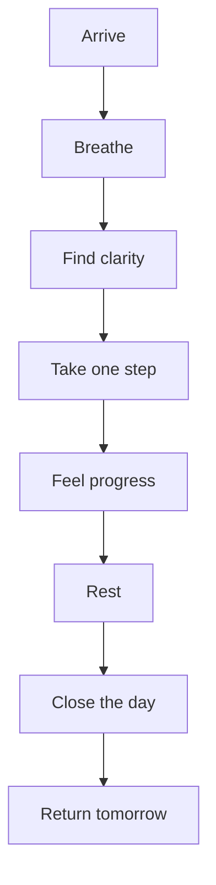
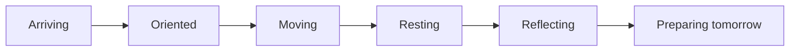

# PERSONALOS_003 — Experience Architecture

## Principle

PersonalOS does not design screens first.
It designs emotional transitions.

A person should not feel that they enter an application.
They should feel that they return to a refuge.

## Emotional journey

## Screen rule

Every screen must reduce stress.

A screen should answer only:

- Where am I?
- What do I do now?
- What happens after?

## Emotional states

## Experience goals

| Space | Emotional goal |
|---|---|
| Refugio | Calm |
| Ritual del Amanecer | Trust |
| Ritual del Foco | Reduced distraction |
| Ritual de Pausa | Permission to breathe |
| Ritual del Cierre | Tranquility |

## Progressive disclosure

Never show the full path when the next step is enough.

## Breathing interface

The interface should allow silence, delay, and visual space.

Movement is not the same as speed.

## No empty screens

An empty state must always invite return or possibility.

## Official vocabulary

| Avoid | Use |
|---|---|
| Task | Step |
| Dashboard | Today / Refugio |
| Project | Journey |
| User | Person / Traveler |
| Complete | Continue / Follow the path |
| Streak | Continuity |
| Score | Growth |

## Personal Mirror

PersonalOS should eventually show evolution as story, not as performance metrics.

## Time Tree

Long-term experience may be represented as a living tree:

- years as trunk rings
- seasons as branches
- journeys as leaves
- steps as growth
- reflections as memory

## Principle

PersonalOS has presence, not sessions.
It is available when useful and invisible when not needed.
