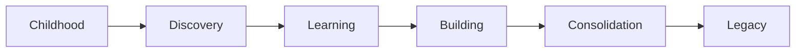

# PERSONALOS_004 — Living System Architecture

## Principle

PersonalOS is not static.
It evolves with the person.

It must be different for a child, a teenager, a student, a professional, a parent, and a person building legacy.

## Eras

A person may move through life eras:



## Living person

A living person includes:

- age
- context
- family
- life stage
- values
- purpose
- experiences
- wisdom

## Identity

Personalization should eventually be discovered more than configured.

The system should gradually reflect the person who inhabits it.

## Memory

PersonalOS stores emotional continuity, not just records.

Memory exists to help a person remember who they were, what they learned, and how they grew.

## Traditions

PersonalOS can support family and personal traditions:

- weekly reflection
- yearly closing
- birthdays
- family rituals
- seasonal reviews

## Legacy Capsules

A Legacy Capsule may contain:

- letter
- reflection
- audio
- video
- photograph
- principle
- story

A capsule belongs to the person who created it and is shared only by conscious choice.

## Family Forest

Each person may have a personal forest.
A family may also share a family forest.

This is not productivity tracking.
It is a representation of shared growth.

## Continuity

PersonalOS does not end when a goal is reached.
It asks:

> What path begins now?

## Symbolic model

```text
○  Presence
🌱 Growth
⟳ Continuity
```

## Purpose

Help a person build a life with intention, preserving balance, memory, and legacy one day at a time.
