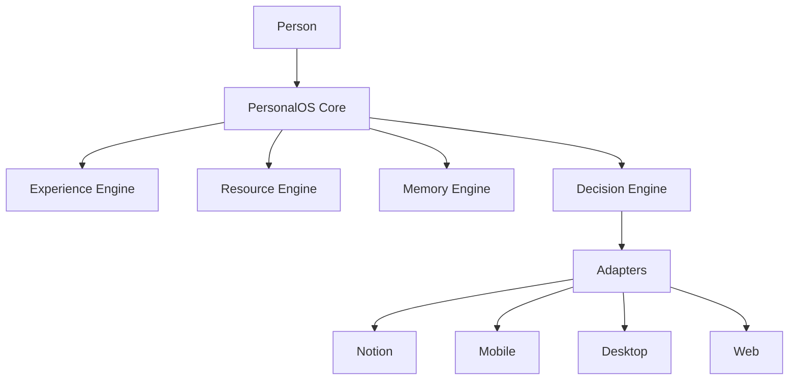
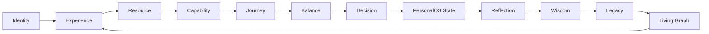

# PERSONALOS_1101 — Aurora Core Architecture Specification

## Purpose

Aurora Core is the platform-neutral heart of PersonalOS.

Notion, mobile, desktop, and web are doors into PersonalOS. They are not the product itself.

The product lives in the core experience, domain model, language, memory, and decision logic.

## Architectural rule

The domain never depends on the interface.

If Notion disappears tomorrow, Aurora Core must remain valid.

## High-level model



## Core engines

### 1. Identity Engine

Owns who the Refugio is prepared for.

Responsibilities:

- name;
- broad profile: adult, teenager, child;
- companion preference;
- language;
- initial rhythm;
- personal context.

It must not ask for unnecessary personal information during the first experience.

### 2. Experience Engine

Owns what the person experiences now.

It does not expose all pending information.
It builds the next human-scale experience.

Inputs:

- balance;
- moment;
- companion;
- recent history;
- available resources;
- current path.

Output:

- one experience state;
- one primary step;
- optional next orientation;
- language intent.

### 3. Resource Engine

Owns external resources such as Classroom, Drive, Calendar, documents, apps, or websites.

Responsibilities:

- discover resources when needed;
- store resource preferences;
- expose capabilities;
- avoid repeated questions;
- keep resource setup just in time.

### 4. Capability Engine

Owns what can be done, independent of the application used.

Examples:

- open;
- read;
- write;
- listen;
- study;
- take notes;
- schedule;
- reflect.

Capabilities are more stable than tools.

### 5. Journey Engine

Owns Caminos and Pasos.

A Camino gives meaning.
A Paso makes movement possible.

### 6. Balance Engine

Owns equilibrium.

It never optimizes blindly for completion.
It may veto a technically valid step if it risks increasing overload.

Possible outputs:

- can advance;
- simplify;
- pause;
- reflect;
- restore energy.

### 7. Reflection Engine

Owns small moments of awareness.

It must never force journaling.
It may offer one question when the moment is right.

### 8. Wisdom Engine

Owns discovered patterns.

It must use humble language and always allow correction.

It must never compare people.

### 9. Legacy Engine

Owns meaningful memory.

It does not store everything.
It preserves what may matter over time.

### 10. Living Graph

Owns relationships among people, paths, steps, resources, reflections, insights, moments, and legacy.

It is the life relationship layer of PersonalOS.

## Engine collaboration



## PersonalOS State

Aurora Core emits a platform-neutral state.

```text
PersonalOSState
├── person
├── profile
├── companion
├── refuge_state
├── current_room
├── current_path
├── primary_step
├── resource_request
├── language_intent
├── balance_state
├── reflection_prompt
└── memory_context
```

Adapters render this state.
They must not own the canonical decision logic.

## Adapter contract

Adapters may:

- render state;
- create or update platform objects;
- open external resources;
- collect minimal input;
- pass events back to Aurora Core.

Adapters must not:

- redefine vocabulary;
- own Flow logic;
- introduce guilt-based language;
- expose overwhelming lists by default;
- store personal meaning outside the core model without mapping.

## Notion Adapter v0.2

The Notion adapter must implement:

- First Experience;
- one initial person only;
- personalized Refugio;
- companion selection;
- safe icon registry;
- clean titles;
- basic Classroom resource setup.

## First Experience contract

The first experience asks only:

1. For whom is this Refugio? Adult, Teenager, Child.
2. How should I call you?
3. How would you like to be accompanied? Aurora or Samwise style.

Then it creates the first Refugio.

Family members are added later from Mi Jardin.

## Resource setup contract

When a Paso requires an unconfigured resource, Aurora asks one small question.

Example:

```text
This path needs Classroom.
How do you prefer to open it?
- Browser
- App
- Later
```

The answer unlocks a capability and the person continues.

## Repository direction

Recommended future structure:

```text
Personal_OS/
├── core/
│   ├── engines/
│   ├── models/
│   └── state.py
├── companions/
├── adapters/
│   ├── notion/
│   ├── mobile/
│   ├── desktop/
│   └── web/
├── installer/
├── docs/
└── samples/
```

## Success criteria

Aurora Core succeeds when the same PersonalOS experience can be rendered through different platforms without losing:

- dignity;
- calm;
- one-step clarity;
- progressive familiarity;
- companion voice;
- meaningful memory;
- human-centered decision logic.

## Final rule

PersonalOS lives in Aurora Core.

Notion is only the first door.
