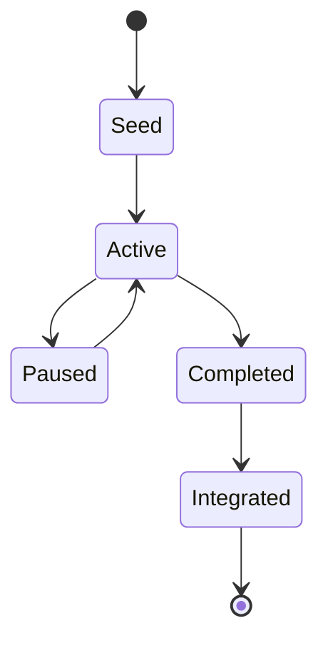
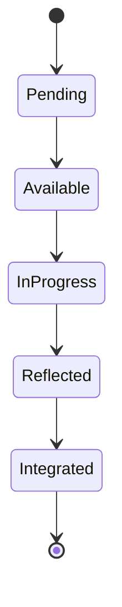
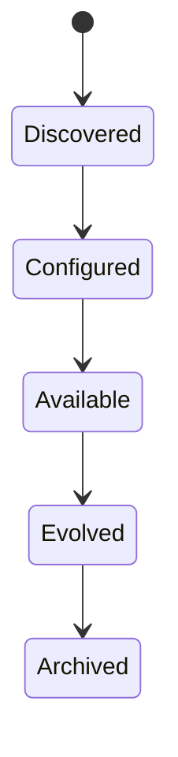
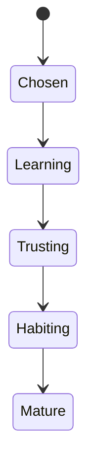
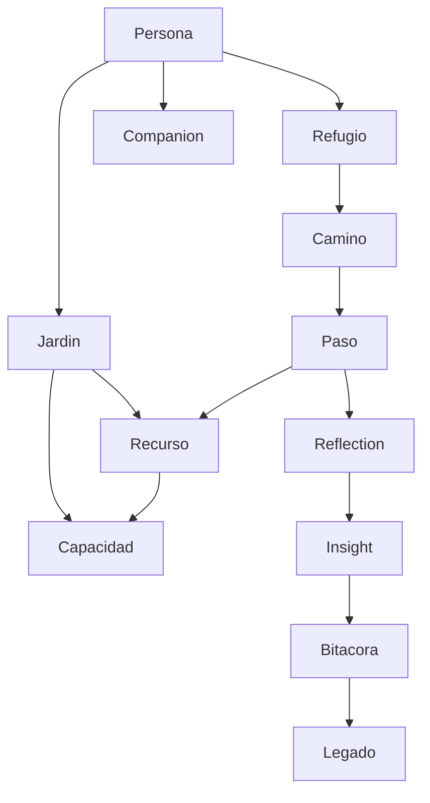

# PERSONALOS_1102 — Domain Model

## Purpose

This document freezes the core language of the PersonalOS domain before deeper implementation.

It defines the fundamental concepts, entities, value objects, aggregates, relationships, and first domain events.

## Domain rule

PersonalOS models a life-centered experience, not a productivity database.

The domain language must remain stable across Notion, mobile, desktop, web, and future platforms.

## Core domain concepts

| Concept | Description |
|---|---|
| Persona | The human center of the system |
| Refugio | The safe place to return |
| Jardin | The living space for resources, people, capabilities, and rituals |
| Camino | A meaningful path of transformation |
| Paso | The smallest clear action |
| Bitacora | Meaningful memory and reflection |
| Legado | What deserves to remain |
| Companion | Voice and style of accompaniment |
| Recurso | External or internal object used by a Paso |
| Capacidad | What can be done through one or more resources |
| Constelacion | Relationship graph of the life domain |

## Aggregate roots

### Persona

Owns identity and personal context.

Contains:

- display name;
- broad profile: adult, teenager, child;
- companion preference;
- language;
- personal rhythm;
- active Refugio.

### Refugio

Owns the safe space experience.

Contains:

- owner persona;
- state;
- current room;
- active Camino;
- current Paso;
- welcome context;
- return history.

### Camino

Owns a path of transformation.

Contains:

- intention;
- domain;
- season;
- status;
- ordered Pasos;
- related resources;
- reflections;
- legacy outcome.

### Jardin

Owns growth of PersonalOS capabilities.

Contains:

- resources;
- capabilities;
- companions;
- people;
- rituals;
- preferences.

### Bitacora

Owns meaningful memory.

Contains:

- reflections;
- notes;
- insights;
- milestones;
- life events.

### Legado

Owns long-term memory.

Contains:

- legacy capsules;
- life chapters;
- teachings;
- significant milestones;
- selected memories.

## Entities

### Paso

A Paso is the smallest meaningful unit of action.

Properties:

- title;
- status;
- energy required;
- friction level;
- resource requirement;
- capability requirement;
- context readiness;
- next orientation.

### Recurso

A Recurso is something the person uses.

Examples:

- Classroom;
- Drive;
- Calendar;
- book;
- PDF;
- website;
- application;
- person;
- place.

### Capacidad

A Capacidad is an action the system can support.

Examples:

- open;
- read;
- write;
- listen;
- study;
- reflect;
- schedule;
- share.

### Reflection

A small moment of awareness.

### Insight

A discovered pattern, always expressed with humility and validation.

### Legacy Capsule

A meaningful preserved artifact.

## Value objects

- ProfileType: Adult, Teenager, Child.
- CompanionStyle: Aurora, Samwise.
- BalanceState: Calm, Loaded, NeedsPause, Moving.
- EnergyLevel: VeryLow, Low, Medium, High, Deep.
- FrictionLevel: VeryLow, Low, Medium, High, VeryHigh.
- Moment: Dawn, Focus, Pause, Closing.
- Season: Spring, Summer, Autumn, Winter.
- ResourceState: Discovered, Configured, Available, Evolved, Archived.
- CapabilityState: Seed, Growing, Mature.
- PathStatus: Seed, Active, Paused, Completed, Integrated.
- StepStatus: Pending, Available, InProgress, Reflected, Integrated.

## Lifecycle models

### Camino lifecycle

### Paso lifecycle

### Recurso lifecycle

### Companion relationship lifecycle

## Relationship model

## Initial domain events

Events describe meaningful change.

- RefugioCreated
- PersonaNamed
- ProfileSelected
- CompanionChosen
- CaminoStarted
- PasoAvailable
- PasoStarted
- PasoCompleted
- ResourceDiscovered
- ResourceConfigured
- CapabilityUnlocked
- ReflectionCaptured
- InsightProposed
- InsightAccepted
- LegacyCapsuleCreated
- SeasonChanged
- BalanceChanged
- ReturnedToRefugio

## Event principle

PersonalOS should be event-oriented because a life is better represented as meaningful moments than as raw CRUD updates.

## Domain boundaries

### Core domain

- Persona
- Refugio
- Camino
- Paso
- Balance
- Companion

### Supporting domains

- Recurso
- Capacidad
- Jardin
- Bitacora
- Legado
- Constelacion

### External domains

- Notion
- Classroom
- Drive
- Calendar
- Mobile OS
- Desktop OS

External domains must be accessed through adapters.

## Anti-corruption rule

External platform concepts must not leak into the core domain.

Example:

Do not model a Paso as a Notion page.
Model a Paso as a Paso, then map it to a Notion page through the adapter.

## Open questions

- Should Refugio be an aggregate root or a projection of Persona plus current state?
- Should Jardin own people, or should people be their own aggregate later?
- Should Companion be a value object first and an entity later?
- What is the minimum event store needed for Notion v0.2?

## Summary

This model defines the stable language of PersonalOS.

Implementation may change. The domain language should not.
