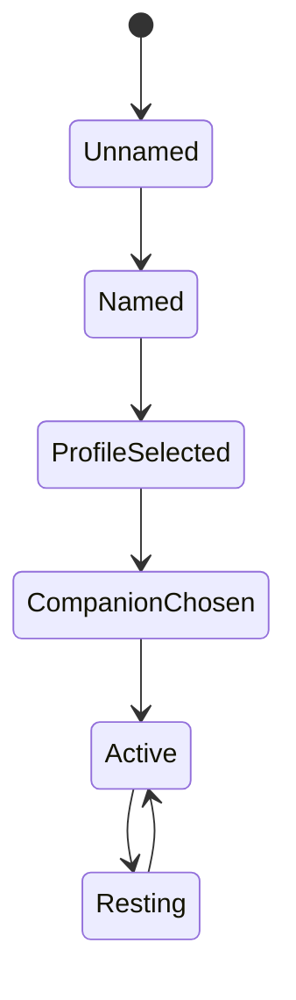
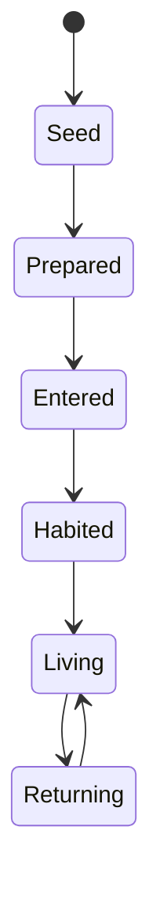
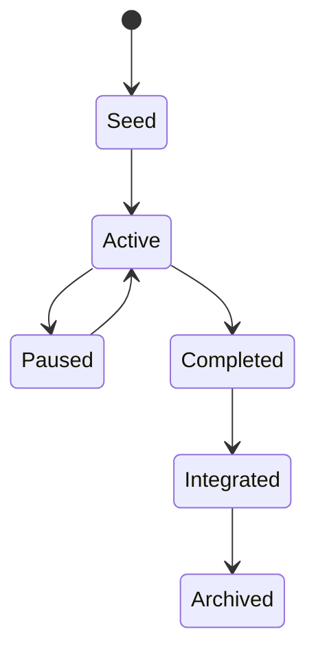
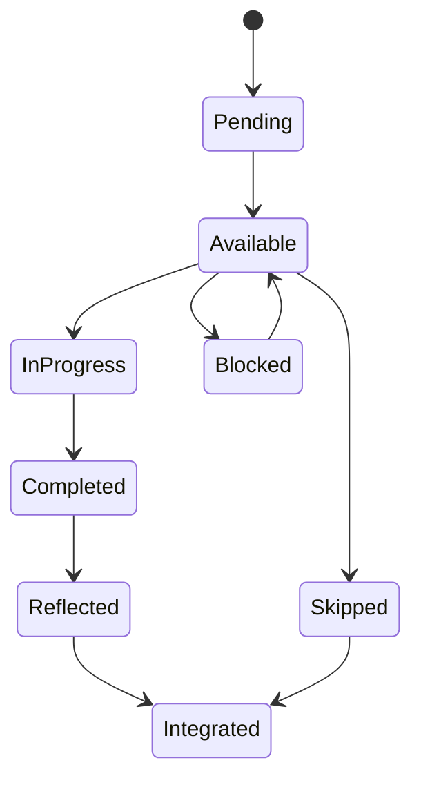
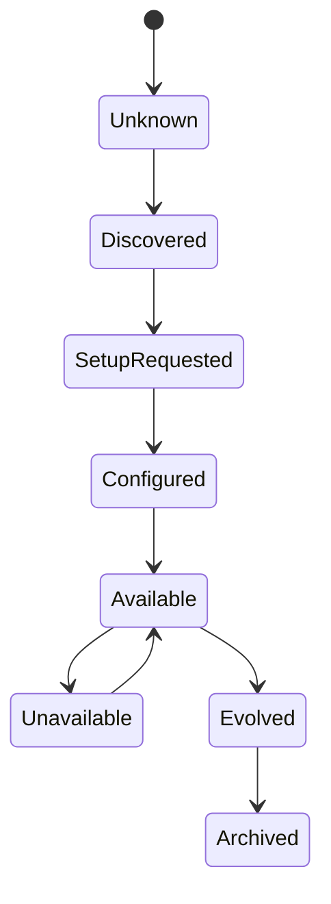
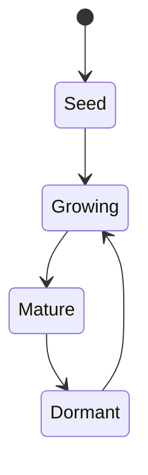
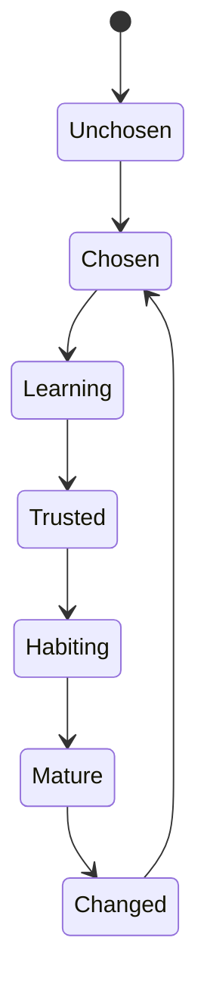
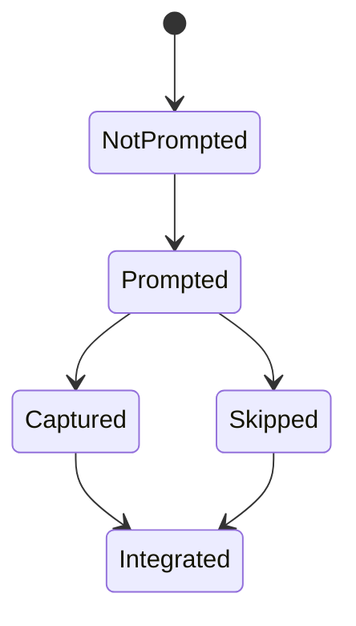

# PERSONALOS_1104 — State Model

## Purpose

This document defines the official state models for the main PersonalOS domain entities.

Events describe what happened.
States describe where an entity is now.

## State principle

PersonalOS states must never be punitive.

A pause is not failure.
A return is not recovery from failure.
A dormant path is not abandoned by default.

## Core state objects

```text
PersonalOSRuntimeState
├── persona_state
├── refugio_state
├── companion_state
├── current_room
├── current_camino_state
├── current_paso_state
├── balance_state
├── resource_states
├── capability_states
├── reflection_state
└── memory_state
```

## Persona state



### Persona states

| State | Meaning |
|---|---|
| Unnamed | The person exists but has not provided a display name |
| Named | The person has chosen how to be called |
| ProfileSelected | Adult, teenager, or child profile selected |
| CompanionChosen | Companion style selected |
| Active | Persona is using the Refugio |
| Resting | Persona is not currently active, without guilt semantics |

## Refugio state



### Refugio states

| State | Meaning |
|---|---|
| Seed | Refugio concept exists but is not configured |
| Prepared | Initial structure created |
| Entered | Person crossed Mellon and entered |
| Habited | Refugio has initial use and memory |
| Living | Refugio is actively part of the person's rhythm |
| Returning | Person returns after time away |

## Room state

Rooms describe where the person is in the experience.

```text
Mellon
Refugio
Camino
Jardin
Bitacora
Constelacion
Legado
```

Rule: every room must provide a clear return to Refugio.

## Camino state



### Camino states

| State | Meaning |
|---|---|
| Seed | The path has been imagined or created but not started |
| Active | The path can currently be walked |
| Paused | The path waits without guilt |
| Completed | The path reached its intended outcome |
| Integrated | Learning from the path became part of memory or legacy |
| Archived | The path is preserved but no longer active |

## Paso state



### Paso states

| State | Meaning |
|---|---|
| Pending | Exists but is not ready yet |
| Available | Ready to be shown as a next step |
| InProgress | Person has started |
| Completed | Step was finished |
| Reflected | A reflection was captured or intentionally skipped |
| Integrated | Step outcome updated the path or memory |
| Blocked | Cannot proceed because context or resource is missing |
| Skipped | The path changed; not punitive |

## Resource state



### Resource states

| State | Meaning |
|---|---|
| Unknown | Aurora has not encountered the resource yet |
| Discovered | A Paso needs this resource |
| SetupRequested | Aurora asked one small setup question |
| Configured | The person provided a preference |
| Available | Resource can be used |
| Unavailable | Resource cannot currently be reached or opened |
| Evolved | Resource gained new capabilities |
| Archived | Resource is preserved but inactive |

## Capability state



### Capability states

| State | Meaning |
|---|---|
| Seed | Capability exists conceptually |
| Growing | Capability has been used but is still being learned |
| Mature | Capability is stable and trusted |
| Dormant | Capability is not currently used |

## Companion state



### Companion states

| State | Meaning |
|---|---|
| Unchosen | No companion style selected yet |
| Chosen | Companion style selected |
| Learning | Companion is still learning preferences |
| Trusted | The person has returned enough to establish confidence |
| Habiting | Companion voice is part of the Refugio rhythm |
| Mature | Companion relationship is stable |
| Changed | Person chose a different style |

## Balance state

Balance is not a score.
It is a qualitative state.

```text
Calm
Moving
Loaded
NeedsPause
Restoring
```

### Balance transition rule

Balance Engine may prevent a Paso from being shown if the required energy or friction is incompatible with current balance.

## Reflection state



Reflection must always remain optional.

## Memory state

```text
WorkingMemory
DailyMemory
SeasonMemory
LifeMemory
Legacy
```

Memory deepens only when meaning appears.

Technical activity does not automatically become memory.

## State transition ownership

| State area | Owning engine |
|---|---|
| Persona | Identity Engine |
| Refugio | Experience Engine |
| Camino | Journey Engine |
| Paso | Journey Engine + Flow Engine |
| Resource | Resource Engine |
| Capability | Capability Engine |
| Companion | Companion Framework |
| Balance | Balance Engine |
| Reflection | Reflection Engine |
| Memory | Wisdom Engine + Legacy Engine |

## MVP state requirements

For Notion v0.2, the minimum required states are:

- Persona: Named, ProfileSelected, CompanionChosen.
- Refugio: Prepared, Entered.
- Paso: Available, InProgress, Completed, Blocked.
- Resource: Discovered, SetupRequested, Configured, Available.
- Companion: Chosen.

## Anti-patterns

Avoid states such as:

- Failed;
- Overdue;
- BrokenStreak;
- InactiveUser;
- Lost;
- Abandoned.

These terms conflict with the PersonalOS dignity model.

## Summary

PersonalOS states describe rhythm, readiness, and meaning.

They must never become judgment.
