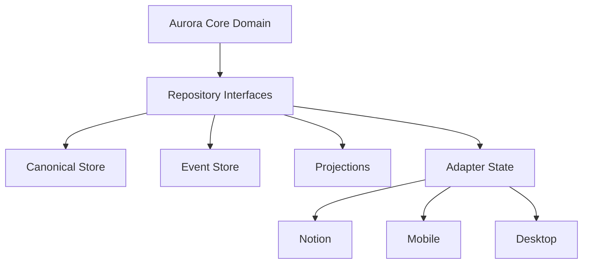

# PERSONALOS_1105 — Persistence Model

## Purpose

This document defines how PersonalOS persists its domain without coupling the core model to Notion or any other external platform.

Notion is a door. It is not the canonical persistence model.

## Persistence principle

Aurora Core owns the domain.
Adapters map the domain into external storage.

The core must never depend on Notion page IDs, database schemas, or platform-specific fields as its source of truth.

## Persistence layers



## Canonical model

The canonical model stores PersonalOS concepts:

- Persona;
- Refugio;
- Jardin;
- Camino;
- Paso;
- Recurso;
- Capacidad;
- Bitacora;
- Legado;
- Companion;
- Living Graph relationships.

It does not store them as Notion pages.

## Event store

Events preserve meaningful change.

The first implementation may use simple JSONL or SQLite.

A full event-sourcing platform is not required for MVP.

Minimum event fields:

```text
EventRecord
├── event_id
├── event_type
├── occurred_at
├── aggregate_type
├── aggregate_id
├── persona_id
├── payload
└── metadata
```

## Projections

Projections are read models created from canonical state and events.

Examples:

- current Refugio view;
- current Paso;
- configured resources;
- recent meaningful activity;
- Bitacora view;
- Jardin view;
- Legacy timeline.

Adapters may render projections, but they do not define them.

## Adapter state

Adapter state stores mapping information only.

Example:

```text
NotionMapping
├── domain_type
├── domain_id
├── notion_object_type
├── notion_object_id
├── notion_url
├── last_synced_at
└── sync_status
```

This mapping allows Aurora Core to know which Notion object represents a domain object without making Notion the domain itself.

## Recommended MVP storage

For Notion v0.2:

```text
installer/.personalos/
├── personalos.db
├── events.jsonl
├── notion_mappings.json
└── config.yaml
```

This local persistence is enough to prevent full reinstall behavior and support future idempotent updates.

## Idempotency requirement

The installer must eventually become idempotent.

Running the installer again should update or repair the existing Refugio instead of always creating duplicates.

Required behavior:

- detect existing root mapping;
- detect existing databases/pages;
- create missing objects only;
- update known objects when schema changes;
- preserve user-created content;
- never delete without explicit confirmation.

## Notion mapping strategy

Each created Notion object should be stored in the mapping file or local database.

Example:

```json
{
  "domain_type": "Refugio",
  "domain_id": "refugio_001",
  "notion_object_type": "page",
  "notion_object_id": "xxxxxxxxxxxxxxxxxxxxxxxxxxxxxxxx",
  "notion_url": "https://notion.so/..."
}
```

## Sync states

```text
NotSynced
Synced
PendingUpdate
Conflict
MissingRemote
ArchivedRemote
```

## Conflict principle

When there is conflict between local canonical state and external platform state, Aurora should not overwrite silently.

It should ask or create a safe repair plan.

## Privacy and portability

The person owns their data.

Persistence must support export and migration.

Minimum export formats:

- JSON;
- Markdown;
- CSV for tabular views;
- ZIP package for complete export.

## Anti-corruption rule

External platform identifiers must remain at the adapter boundary.

Domain objects may reference stable domain IDs only.

Bad:

```text
Paso.id = notion_page_id
```

Good:

```text
Paso.id = paso_123
Mapping links paso_123 to notion_page_id
```

## Storage evolution

### Stage 1 — Notion prototype

- Notion holds visible structures.
- Local mapping is optional but recommended.

### Stage 2 — Notion v0.2

- Local mapping required.
- Installer becomes idempotent.
- First Experience state is persisted.

### Stage 3 — Aurora Core v0.1

- SQLite canonical store.
- JSONL event store.
- Notion adapter reads/writes through repositories.

### Stage 4 — Multi-platform

- Sync layer introduced.
- Mobile and desktop use the same canonical model.

### Stage 5 — Long-term

- Optional encrypted personal vault.
- Optional cloud sync.
- Full export and migration support.

## Minimal repositories

```text
PersonaRepository
RefugioRepository
CaminoRepository
PasoRepository
ResourceRepository
CapabilityRepository
EventRepository
MappingRepository
```

## MVP persistence priority

For the next implementation milestone, prioritize:

1. config persistence;
2. Notion object mapping;
3. first person state;
4. companion selection;
5. Classroom resource configuration;
6. installer idempotency foundation.

## Summary

Persistence exists to preserve continuity.

It must never trap the person inside one platform.

PersonalOS data belongs to the person, not to Notion, not to the adapter, and not to the installer.
