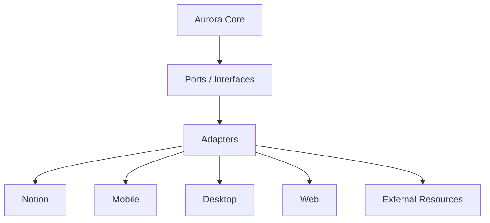

# PERSONALOS_1106 — Adapter Contracts

## Purpose

This document defines how external platforms connect to Aurora Core without contaminating the PersonalOS domain.

Adapters are doors into PersonalOS. They are not the product.

## Core rule

Adapters render, synchronize, and execute platform-specific actions.

They must not own domain decisions.

## Adapter boundary



## What adapters may do

Adapters may:

- render PersonalOSState;
- collect minimal user input;
- create or update platform objects;
- open resources;
- read adapter-specific metadata;
- emit events back to Aurora Core;
- persist mapping information;
- handle platform errors gracefully.

## What adapters must not do

Adapters must not:

- redefine PersonalOS vocabulary;
- decide the next Paso;
- alter Balance rules;
- introduce guilt-based language;
- expose overwhelming lists by default;
- store meaning as platform-only data;
- treat platform IDs as domain IDs;
- bypass Aurora Core for domain changes.

## Required adapter ports

### RenderPort

Receives a platform-neutral state and renders it.

```text
render(state: PersonalOSState) -> RenderResult
```

### InputPort

Collects one minimal answer at the appropriate time.

```text
collect(prompt: InputPrompt) -> UserInput
```

### ResourcePort

Opens or prepares resources.

```text
open(resource: ResourceRef, capability: CapabilityRef) -> ResourceResult
```

### MappingPort

Maps domain IDs to platform IDs.

```text
resolve(domain_id: DomainId) -> PlatformRef
store(mapping: AdapterMapping) -> None
```

### EventPort

Sends meaningful events back to Aurora Core.

```text
emit(event: DomainEvent) -> None
```

### SyncPort

Keeps platform state aligned with Aurora Core projections.

```text
sync(projection: Projection) -> SyncResult
```

## Notion Adapter contract

The Notion Adapter is the first implementation door.

Responsibilities:

- create PersonalOS root page;
- create Refugio;
- create required databases;
- create clean titles with Notion-safe icons;
- store Notion mappings locally;
- support idempotent reinstall/update;
- render First Experience;
- configure Classroom resource through a simple prompt.

Notion Adapter must not:

- hardcode family structures;
- create duplicate pages when mappings exist;
- store domain truth only in Notion;
- use emoji duplication in titles;
- expose technical configuration language.

## Mobile Adapter contract

Future mobile adapters must:

- preserve Refugio-first experience;
- support Mellon as threshold;
- support companion voice;
- support quick resource opening;
- support low-friction check-ins;
- avoid attention-capturing patterns.

Mobile notifications must be rare, respectful, and explainable.

## Desktop Adapter contract

Future desktop adapters must:

- support longer focus sessions;
- support local files as resources;
- support offline mode;
- preserve the same domain language;
- avoid becoming a productivity dashboard.

## Web Adapter contract

Future web adapters must:

- render the same core projections;
- support export and portability;
- support multi-device continuity;
- preserve PersonalOS language and states.

## Resource Adapter contract

External resources such as Classroom, Drive, Calendar, Spotify, or local files should follow a common model.

```text
ResourceAdapter
├── can_open
├── open
├── configure
├── capabilities
├── status
└── metadata
```

Resource adapters should expose capabilities, not platform complexity.

Example:

```text
ClassroomAdapter
├── capability: open
├── preferred_mode: browser
└── url: https://classroom.google.com
```

## Error language

Adapters must translate technical errors into PersonalOS language.

Avoid:

```text
APIError 400
Token invalid
Object not found
```

Prefer:

```text
Encontré un obstáculo para abrir este recurso.
Podemos revisarlo juntos.
```

## Idempotency contract

All creation adapters must support a future idempotent mode.

Required behavior:

- check mapping before create;
- check remote existence when mapping exists;
- recreate missing remote objects only with confirmation or safe repair;
- update schema without deleting user content;
- record sync status.

## Anti-corruption examples

Bad:

```text
Flow Engine checks Notion database rows directly.
```

Good:

```text
Notion Adapter reads rows, maps them to domain objects, then Aurora Core decides.
```

Bad:

```text
Paso.id equals Notion page id.
```

Good:

```text
Paso.id is a domain id. MappingPort links it to a Notion page id.
```

## Minimum Notion v0.2 adapter requirements

- First Experience prompts.
- One initial Persona only.
- Companion selection.
- Clean titles.
- Safe icon registry.
- Local mapping file.
- Classroom Resource setup.
- Duplicate prevention foundation.

## Summary

Adapters are doors.

Aurora Core is the home.

The person should feel the same PersonalOS experience no matter which door they use.
