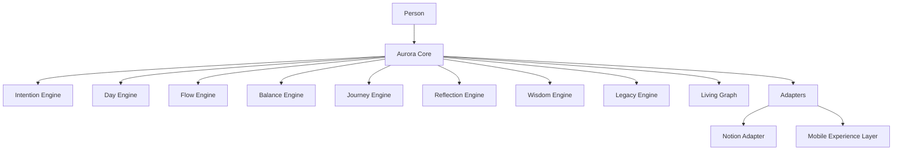
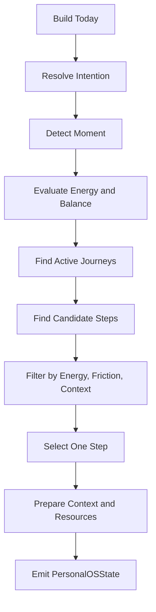

# PERSONALOS_100 — Aurora Core Specification

## Purpose

Aurora Core is the internal core of PersonalOS.

It owns the human-centered logic of the product and must remain independent from any specific interface or storage platform.

Notion is an adapter.
A future mobile application will be another adapter.
Aurora Core is the stable center.

## Non-goals

Aurora Core is not:

- a Notion template engine;
- a task manager;
- a productivity scoring system;
- an engagement engine;
- a replacement for human will.

## Design contract

Aurora Core must respect the PersonalOS axioms and immutable principles.

Every engine must answer:

> What aspect of the person's life does this protect?

If the answer is not attention, energy, balance, intention, memory, privacy, continuity, or legacy, the component should be reconsidered.

## High-level architecture



## Core responsibilities

Aurora Core is responsible for:

- modeling the person;
- modeling today;
- modeling journeys and steps;
- deciding the next appropriate step;
- preserving balance over productivity;
- reducing friction to start;
- enabling reflection;
- turning reflections into wisdom;
- preserving continuity and legacy;
- producing platform-independent experience state.

## Core state

Aurora Core produces a platform-neutral state object.

```text
PersonalOSState
├── person
├── today
├── moment
├── energy
├── balance
├── current_journey
├── next_step
├── after_step
├── ritual
├── reflection_prompt
├── journey_state
├── theme
├── season
└── legacy_context
```

Adapters render this state.
They do not own the product logic.

## Engine overview

### Intention Engine

Protects purpose.

Transforms human intention into journeys.

Example:

```text
Intention: approve Mathematics
Journey: Mathematics recovery path
Steps: open Classroom, read assignment, solve exercise 1
```

### Day Engine

Protects clarity of today.

Builds the daily experience context.

It answers:

> What does this person need today?

### Flow Engine

Protects movement.

Reduces friction to start.

It answers:

> What obstacle can be removed before the person begins?

### Balance Engine

Protects wellbeing.

Evaluates whether the proposed next step is appropriate for the person's current state.

It does not maximize completion.
It preserves equilibrium.

### Journey Engine

Protects direction.

Models journeys as meaningful paths composed of steps.

### Reflection Engine

Protects learning.

Offers small reflection prompts and stores human-scale reflections.

### Wisdom Engine

Protects personal knowledge.

Discovers patterns only for the person who generated them.

It must never compare people.

### Legacy Engine

Protects memory with meaning.

Preserves reflections, capsules, values, and life continuity.

### Living Graph

Protects relationship awareness.

Models the connections among journeys, steps, balance, energy, rituals, family, and legacy.

## Decision flow



## The One Step contract

Aurora Core must return one primary next step.

It may include an `after_step`, but only as orientation.

It must not produce a list as the primary experience.

## Step readiness

A step is ready when:

- it is small enough to start;
- required resources are known;
- context is available;
- friction is acceptable;
- energy requirement is compatible with current energy;
- the system can explain why this step is being shown.

## Adapter contract

Adapters must:

- render Aurora Core state;
- avoid adding unrelated UI complexity;
- preserve vocabulary;
- preserve calm language;
- avoid guilt, scores, pressure, and comparison;
- never own the canonical logic.

## Storage contract

Storage must support export and migration.

The traveler owns the data.

## Initial implementation roadmap

```text
core/
├── models/
│   ├── person.py
│   ├── day.py
│   ├── journey.py
│   ├── step.py
│   └── reflection.py
├── engines/
│   ├── intention.py
│   ├── day.py
│   ├── flow.py
│   ├── balance.py
│   ├── journey.py
│   ├── reflection.py
│   ├── wisdom.py
│   └── legacy.py
├── state.py
└── adapters/
    └── notion/
```

## Engineering principles

- Core first.
- Adapters second.
- Experience consistency over platform convenience.
- Deterministic behavior before automation.
- Human dignity before optimization.

## Open questions

- What is the minimum viable `PersonState` for Notion v0.2?
- Should `Energy` and `Balance` be manually selected at first?
- How should Aurora Core handle incomplete context?
- What is the first version of Living Graph that provides value without complexity?

## Summary

Aurora Core is the foundation that allows PersonalOS to grow beyond Notion without losing its identity.

It exists to preserve the same promise across every future platform:

> One day at a time. One step at a time.
