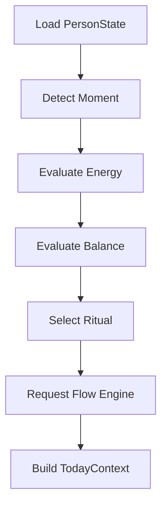

# PERSONALOS_101 — Day Engine

## Mission

The Day Engine builds the experience of **Today**.

It does not schedule an agenda. It prepares a day that feels understandable, calm and actionable.

## Responsibility

Given a person and the current context, produce a complete `TodayContext`.

## Inputs

- PersonState
- Current date
- Current moment
- Active journeys
- Energy
- Balance
- Pending reflections
- Ritual calendar

## Output

```text
TodayContext
├── greeting
├── moment
├── balance
├── energy
├── ritual
├── next_step
├── after_step
├── reflection_prompt
└── closing_focus
```

## Decision pipeline



## Design rules

- Only one primary step.
- Maximum one secondary step.
- Never expose backlog by default.
- Prefer clarity over completeness.
- Preserve emotional calm.

## Failure handling

If no step is appropriate:

- suggest a pause;
- invite reflection;
- recommend restoring energy;
- never fabricate urgency.

## Adapter contract

Every interface (Notion, Android, iOS, Web) renders the same TodayContext without changing its meaning.
