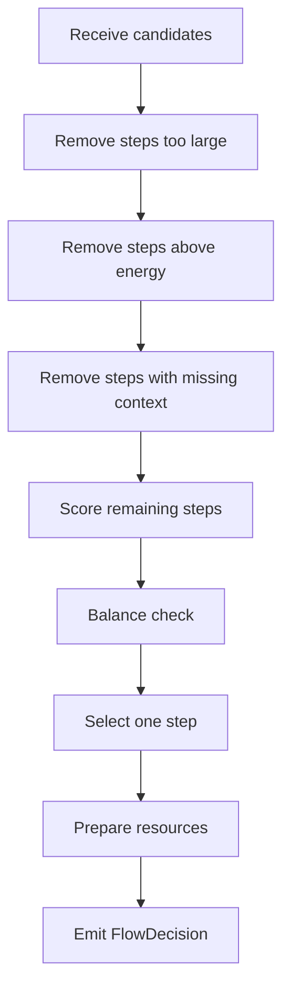
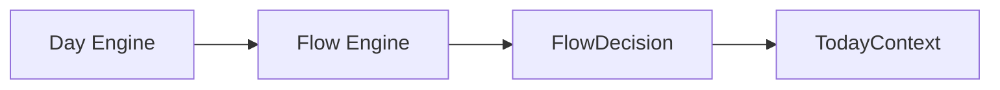

# PERSONALOS_102 — Flow Engine

## Mission

The Flow Engine selects the next appropriate step by reducing friction to start.

It does not optimize for productivity.
It optimizes for movement with balance.

## Responsibility

Given a person, a day context, and candidate steps, produce one `FlowDecision`.

## Inputs

- TodayContext
- PersonState
- Active journeys
- Candidate steps
- Energy level
- Balance state
- Moment
- Available resources
- Context completeness

## Output

```text
FlowDecision
├── selected_step
├── after_step
├── reason
├── friction_level
├── energy_fit
├── context_ready
├── resources_needed
├── suggested_ritual
└── fallback_if_blocked
```

## Primary rule

The Flow Engine must return one primary step.

If several steps are possible, it chooses the one that best satisfies:

1. lowest safe friction;
2. compatible energy requirement;
3. available context;
4. clear next action;
5. emotional safety;
6. meaningful continuity.

## Step scoring model

The first implementation may use deterministic scoring.

```text
score =
  energy_fit
+ context_ready
+ low_friction
+ continuity_bonus
+ ritual_fit
- overload_risk
- ambiguity_penalty
```

The highest score does not automatically win if it violates balance.

Balance can veto.

## Decision pipeline



## Friction levels

```text
Very Low  — can start immediately
Low       — needs minor orientation
Medium    — needs setup or emotional readiness
High      — should be reduced before showing
Very High — not a valid next step yet
```

## Energy fit

```text
Very Low energy  -> only tiny steps
Low energy       -> small steps
Medium energy    -> normal steps
High energy      -> demanding steps allowed
Full energy      -> deep work possible
```

## Flow safety rules

The Flow Engine must never select a step that:

- increases guilt;
- exposes an overwhelming backlog;
- requires high effort when energy is very low;
- has unclear resources;
- hides important risk;
- creates urgency without cause.

## Fallback behavior

If no step is safe:

```text
FlowDecision
├── selected_step: null
├── suggested_ritual: pause
├── reason: no safe step available
└── fallback_if_blocked: recover balance first
```

## Flow language

The reason should be human-readable and calm.

Avoid:

- urgent;
- late;
- failed;
- overdue;
- must.

Prefer:

- this is a small place to begin;
- this step is ready;
- this keeps the path moving;
- this protects your energy.

## Relationship with Day Engine



The Day Engine asks.
The Flow Engine selects.
The adapter renders.

## Relationship with Balance Engine

Balance Engine may veto a FlowDecision.

Example:

```text
Candidate: Solve full exam
Energy: Low
Balance: Cargado
Decision: reject and propose smaller step
```

## MVP behavior

For Notion v0.2, the Flow Engine can be implemented as deterministic logic over mission properties:

- Estado
- Momento
- Dominio
- Tiempo
- Balance
- Energía requerida
- Fricción
- Siguiente paso
- Después

## Required schema additions

The current `Misiones` database should eventually add:

```text
Energía requerida
Fricción
Contexto listo
Recurso principal
Bloqueada
Razón de bloqueo
```

## Summary

The Flow Engine is the first operational heart of PersonalOS.

Its question is not:

> What should be completed next?

Its question is:

> What is the smallest clear step that can safely begin now?
