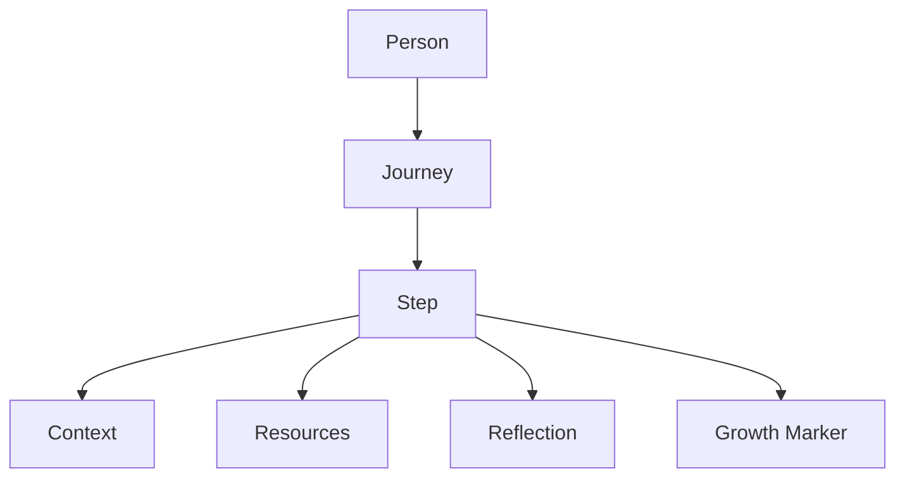
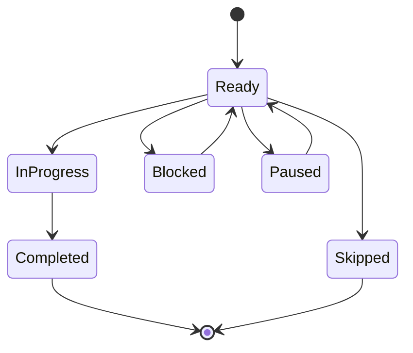
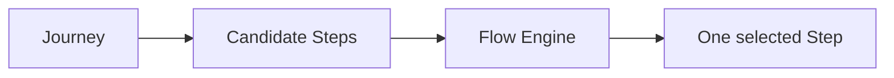

# PERSONALOS_103 — Journey and Step Model

## Purpose

This document defines the core domain entities `Journey` and `Step`.

A `Step` is the minimum unit of action in PersonalOS.
A `Journey` is a meaningful path composed of steps.

## Design principle

PersonalOS does not manage tasks.
It helps a person move through steps inside meaningful journeys.

## Domain relationship



## Journey

A Journey is a meaningful path with direction.

Examples:

- Recover Mathematics
- Improve sleep
- Prepare university admission
- Build a personal habit
- Organize family routines

A Journey should not be defined only as a project.
It is a path of transformation.

## Journey properties

```text
Journey
├── id
├── title
├── person_id
├── domain
├── intention
├── status
├── season
├── current_step_id
├── next_step_id
├── balance_impact
├── created_at
├── updated_at
└── archived_at
```

## Journey status

```text
Active
Paused
Resting
Completed
Archived
```

`Paused` is not failure.
`Resting` means the Journey should not be pushed today.

## Step

A Step is the smallest meaningful action that can start with low cognitive load.

If a person must plan before starting, the Step is too large.

## Step properties

```text
Step
├── id
├── journey_id
├── title
├── status
├── moment
├── domain
├── duration_minutes
├── energy_required
├── friction_level
├── context_ready
├── resource_primary
├── resource_links
├── next_step_id
├── after_text
├── blocked
├── blocked_reason
├── completed_at
├── created_at
└── updated_at
```

## Step status

```text
Ready
In Progress
Paused
Blocked
Completed
Skipped
Archived
```

`Skipped` must not be punitive.
It only means the path changed.

## Step readiness rule

A Step is ready when:

- it is small;
- it has a clear verb;
- it has known context;
- it has compatible energy requirement;
- it has acceptable friction;
- it has at least one clear resource or no resource is needed.

## Step sizing rule

A Step should usually fit one of these patterns:

```text
Open something
Read one thing
Write one sentence
Prepare one object
Choose one next action
Do one small exercise
Take one short pause
```

Avoid large steps such as:

```text
Study Mathematics
Clean room
Fix everything
Organize school
Prepare exam
```

These are Journeys or groups of Steps.

## Energy required

```text
Very Low
Low
Medium
High
Deep
```

## Friction level

```text
Very Low
Low
Medium
High
Very High
```

A very high friction Step should be decomposed or prepared before being shown.

## Context readiness

```text
Ready
Partial
Missing
Unknown
```

The Flow Engine should prefer `Ready` steps.

## Mermaid state model



## Notion mapping v0.2

Current `Misiones` can represent early Step behavior.

Required additions:

| Aurora Step | Notion property |
|---|---|
| title | Misión |
| person_id | Persona |
| status | Estado |
| moment | Momento |
| domain | Dominio |
| duration_minutes | Tiempo |
| energy_required | Energía requerida |
| friction_level | Fricción |
| context_ready | Contexto listo |
| resource_primary | Recurso principal |
| blocked | Bloqueada |
| blocked_reason | Razón de bloqueo |
| after_text | Después |

## Journey mapping v0.2

A new Notion database should eventually be introduced:

```text
🧭 Journeys
├── Journey
├── Persona
├── Dominio
├── Intención
├── Estado
├── Estación
└── Paso actual
```

## Relationship with Flow Engine

The Flow Engine selects from ready Steps.



## Relationship with Reflection Engine

A completed Step can generate a small reflection opportunity.

Reflection must remain optional and lightweight.

## Summary

`Step` is the atomic unit of PersonalOS.

`Journey` gives meaning to steps.

PersonalOS should always prefer a smaller clear Step over a larger impressive task.
