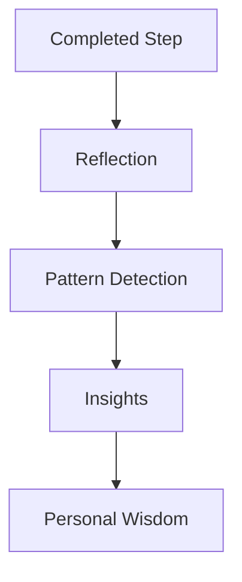

# PERSONALOS_104 — Reflection & Wisdom Engine

## Mission

Transform lived experience into personal wisdom without increasing cognitive load.

Reflection is optional.
Wisdom is emergent.

## Guiding principle

PersonalOS does not collect journals.
It cultivates small moments of awareness.

## Reflection Engine

### Responsibilities

- Offer at most one reflection prompt.
- Trigger reflections at meaningful moments.
- Keep interactions under one minute.
- Never require reflection to continue.

### Triggers

- Completion of a meaningful Step.
- End of day.
- End of a Journey milestone.
- Beginning of a new season.
- Voluntary reflection.

### Reflection model

```text
Reflection
├── id
├── person_id
├── journey_id
├── step_id
├── prompt
├── answer
├── mood
├── created_at
└── tags
```

## Prompt principles

Questions should be:

- short;
- concrete;
- kind;
- non-judgmental.

Examples:

- What made today easier?
- What would you repeat tomorrow?
- What obstacle surprised you?
- What are you grateful for today?

## Wisdom Engine

### Mission

Discover recurring personal patterns from reflections and lived activity.

It does not evaluate the person.
It learns alongside them.

### Wisdom model

```text
Insight
├── id
├── pattern
├── confidence
├── evidence_count
├── first_seen
├── last_seen
├── related_journeys
└── recommendation
```

### Example insights

- Morning is your best focus period.
- Short sessions help you start.
- Walking before studying improves continuity.

## Learning pipeline



## Privacy contract

Insights belong exclusively to the traveler.

No comparison between people.
No ranking.
No advertising.
No external profiling.

## Adapter behavior

Notion and future applications render reflections and insights.
Aurora Core owns the learning logic.

## MVP

The first implementation uses deterministic rules.
Machine learning is not required.

## Success metric

The quality of the engine is measured by one question:

> Does this help the person understand themselves a little better?
