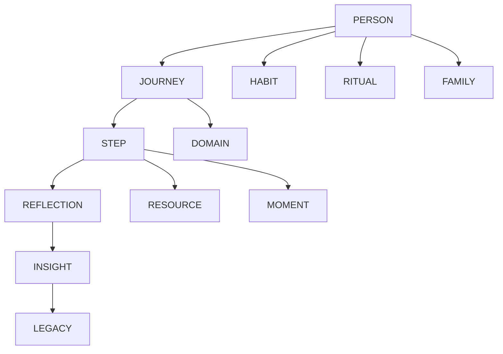

# PERSONALOS_105 — Living Graph

## Mission

The Living Graph is Aurora Core's relationship model.

It does not primarily store information.
It models how the important parts of a person's life influence one another.

## Purpose

Traditional systems organize data in lists.
Living Graph organizes meaning through relationships.

## Core node types

```text
Person
Journey
Step
Reflection
Insight
Legacy Capsule
Habit
Ritual
Season
Domain
Family Member
Resource
Moment
```

## Relationship model



## Graph principles

- Relationships have meaning.
- Meaning evolves.
- Nothing is permanently disconnected.
- History is preserved.
- Privacy is preserved by design.

## Edge examples

```text
supports
blocks
belongs_to
continues
depends_on
inspires
shared_with
created_from
strengthens
weakens
```

## Example

Morning Walk
   supports
Energy
   supports
Study Journey
   generates
Reflection
   produces
Insight

The graph keeps this chain visible.

## Graph queries

Aurora Core should eventually answer questions such as:

- What habits most improve my balance?
- Which rituals reduce starting friction?
- Which journeys reinforce one another?
- Which resources are most frequently used?
- What usually precedes a successful day?

## Privacy

The graph belongs to the traveler.

It is not a recommendation network.
It is not a social graph.
It is never used for advertising.

## MVP

Version 0.2 may implement the graph as relationships in SQLite/PostgreSQL.
A dedicated graph database is not required initially.

## Future

The Living Graph will become the substrate for the Meaning Engine, allowing Aurora Core to discover meaningful relationships instead of isolated statistics.
