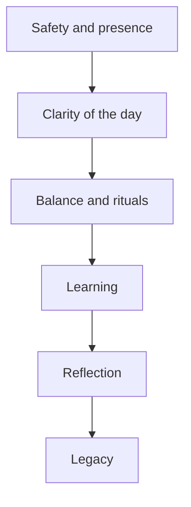
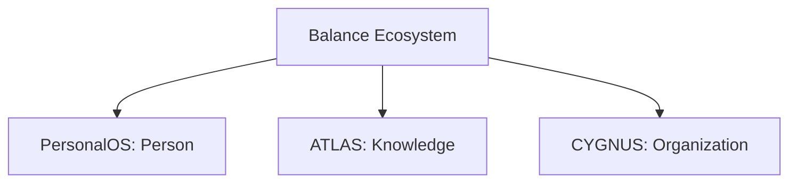

# PERSONALOS_005 — Human Dignity Framework

## First principle

The person is always worth more than the system.

If a technical decision benefits the system but harms the person, the decision is wrong.

## Five pillars

### Dignity

The interface must never shame, humiliate, compare, or reduce a person to performance.

### Autonomy

PersonalOS accompanies.
It does not control.

### Presence

The system is available without invading.

### Continuity

Every person has the right to stop, change, and return.

### Legacy

Life is not measured by completed tasks.
It is remembered through learning, values, growth, and lived experience.

## Rights of the traveler

- Right to start again.
- Right to silence.
- Right to privacy.
- Right to make mistakes.
- Right to change.

## Duties of the system

PersonalOS must protect:

- attention
- energy
- memory
- balance
- time
- intention
- legacy

## Needs pyramid

## Ecosystem relation

## Ecosystem motto

Technology in service of human flourishing.
