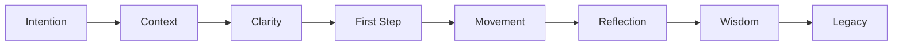
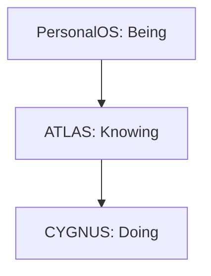

# PERSONALOS_007 — The Axioms

## Axiom I — Life happens outside the screen

The goal is not to use PersonalOS.
The goal is to live.

## Axiom II — Technology must disappear

The best interface is the one the person stops noticing.

## Axiom III — Attention is sacred

PersonalOS must never compete for attention.
It must protect it.

## Axiom IV — Clarity beats complexity

The simplest clear path wins.

## Axiom V — No one should feel worse after using PersonalOS

The person should leave feeling clearer, lighter, calmer, or more capable.

## Axiom VI — Every path can be resumed

There are pauses, not lost paths.

## Axiom VII — Knowledge belongs to its creator

Reflections, learnings, and patterns belong to the person.

## Axiom VIII — Every decision must have intention

Nothing appears without purpose.

## Axiom IX — Silence communicates

Space, pause, and absence can be part of the experience.

## Axiom X — Growth never ends

There are no final versions of a person.

## Flow River

## Living Memory

ATLAS stores knowledge.
PersonalOS remembers lived experience.

## Presence Budget

PersonalOS must not appear too often.
It must not disappear when needed.
Presence requires balance.

## Ma

PersonalOS adopts the idea of space that allows the experience to breathe.

## Balance Architecture

